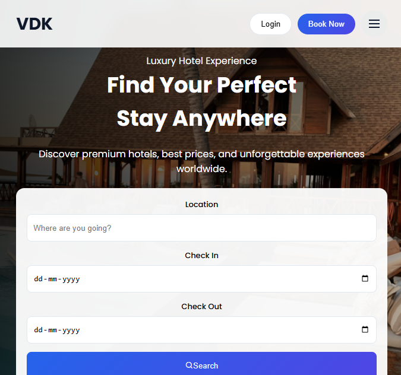

# Advanced Responsive Navbar UI

A modern, high-performance **responsive navigation bar** with an interactive mobile menu, built to deliver clean UI/UX and seamless experiences across all devices.

<p align="center">
  <a href="https://advanced-responsive-navbar.vercel.app" target="_blank">
    
  </a>
</p>

---

## Preview



---

## Features

* Fully responsive layout (mobile, tablet, desktop)
* Interactive hamburger menu with slide-in animation
* Background overlay with blur effect
* Integrated close button for mobile navigation
* Sticky navbar with backdrop filter
* Desktop hover effects with smooth transitions
* Scroll lock when menu is active
* Clean, modern UI design principles

---

## Tech Stack

<p>
  
  
  
  
</p>

---

## Project Structure

```id="proj001"
advanced-responsive-navbar/
│── index.html
│── style.css
│── script.js
│
└── imgs/
    ├── navbar.png
    ├── hero-banner.png
    └── favicon.svg
```

---

## How It Works

The navigation system is powered by simple JavaScript interactions:

```js id="proj002"
hamburger.addEventListener("click", () => {
  navMenu.classList.add("active");
  overlay.classList.add("active");
  document.body.classList.add("menu-open");
});
```

* Hamburger click → opens menu
* Overlay click → closes menu
* Scroll disabled while menu is open

---

## Responsive Behavior

| Device  | Layout                               |
| ------- | ------------------------------------ |
| Desktop | Horizontal navbar with hover effects |
| Tablet  | Adaptive spacing                     |
| Mobile  | Slide-in menu with overlay           |

---

## Getting Started

```bash id="proj003"
git clone https://github.com/your-username/advanced-responsive-navbar.git
cd advanced-responsive-navbar
```

Open `index.html` in your browser.

---

## Customization

* Update colors via `:root` variables in CSS
* Replace logo text (`VDK`)
* Modify navigation links
* Change images inside `/imgs`

---

## License

This project is licensed under the MIT License.
